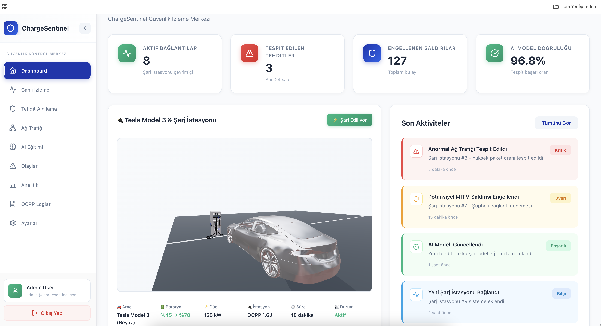

# 🔋 ChargeSentinel Frontend

EV Charging Station Security & Monitoring System

## 📖 Proje Hakkında

ChargeSentinel, elektrikli araç şarj istasyonlarının güvenlik ve izleme sistemidir. Sanal OCPP şarj istasyonlarını izleyerek normal/anormal ağ trafiğini analiz eder, sızıntıları tespit eder ve AI modeli ile tehdit algılama yapar.

## 🎨 Özellikler

- **Canlı İzleme**: Şarj istasyonlarının gerçek zamanlı durumu
- **Tehdit Algılama**: Anormal ağ trafiği ve saldırı tespiti
- **3D Görselleştirme**: Tesla Model 3 ve şarj istasyonu 3D modelleri
- **Dashboard**: Son aktiviteler, analitik ve OCPP logları

## 🖼️ Ekran Görüntüleri

### Dashboard


### 3D Charging Scene


### Dashboard Overview


## 📸 Sistem Görüntüleri

<details>
<summary><b>Ekran Görüntüsü 1</b> (Genel Bakış)</summary>


</details>

<details>
<summary><b>Ekran Görüntüsü 2</b></summary>


</details>

<details>
<summary><b>Ekran Görüntüsü 3</b></summary>


</details>

<details>
<summary><b>Ekran Görüntüsü 4</b></summary>


</details>

<details>
<summary><b>Ekran Görüntüsü 5</b></summary>


</details>

<details>
<summary><b>Ekran Görüntüsü 6</b></summary>


</details>

<details>
<summary><b>Ekran Görüntüsü 7</b></summary>


</details>

## 🚀 Kurulum

```bash
# Bağımlılıkları yükleyin
npm install

# Development server'ı başlatın
npm run dev
```

Tarayıcıda `http://localhost:5173` adresini açın.

## 📁 Proje Yapısı

```
src/
├── app/
│   ├── Login/           # Giriş sayfası
│   └── Dashboard/       # Ana dashboard
│       ├── Components/
│       │   ├── Sidebar/
│       │   └── ChargingStation/  # 3D şarj sahnesi
│       └── Dashboard.tsx
└── App.tsx
```

## 🛠️ Teknolojiler

- React 18 + TypeScript
- Three.js + React Three Fiber (3D)
- React Router
- Vite

## 📝 Menü Yapısı

1. Dashboard
2. Canlı İzleme
3. Tehdit Algılama
4. Ağ Trafiği
5. AI Eğitimi
6. Olaylar
7. Analitik
8. OCPP Logları
9. Ayarlar

---

**Not**: Bu proje ders projesi olarak geliştirilmiştir.
